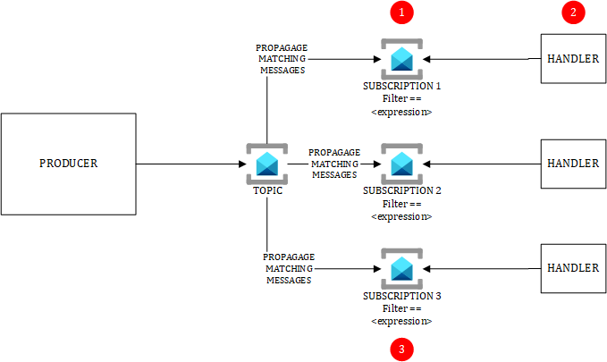

# PUB/SUB with Azure Service Bus in PUSH/PULL

The PUB/SUB pattern is popular in Event-Driven Architectures and Microservices. The producer of a message is agnostic of its subscriber(s). Each subscriber receives a copy of the original message sent by the topic.The above diagram and below attention points are applicable only to Service Bus in PUSH/PULL mode. To be clear, PUSH/PULL means that the sender **pushes** the message to Service Bus, while the receiver **receives** it through a **pull** mechanism. In other words, the receiver initiates the call to Service Bus and polls it to see if new messages landed in the subscription.

# Attention points
## (1) Filters
Make sure to version your messages sent to the topic and to include the version into the subscription filters (along with other filter criteria). This helps maintain backward compatibility and allows you to change the structure of a message (including breaking changes) without harming the current subscribers of a given version. You may rollout a new "release" gradually and support side-by-side multiple versions of a given message.

## (2) Pull-based when using Service Bus
Azure Service Bus is based on a pull-based architecture. This means that handlers connect to the subscriptions to dequeue messages. From a firewall perpective, you need to allow the handler's outbound traffic to talk to the service bus using AMQP or AMQPS protocols. The pull-based approach is Hub & Spoke friendly as it can be fully isolated from internet.

## (3) Topic/Queue sizes and potential bottleneck
In a pull-based approach, the potential bottleneck of the architecture is Azure Service Bus itself. You must pay particular attention to:

- Topic max size limits. When topics are full, senders cannot send any new message.
- Make sure to assess how long the Service Bus could buffer messages in case your handlers are down.
- Make sure to assess the overall throughput required.

The center of gravity of your architecture is the message broker itself.

# Pros & Cons of Pub/Sub using Azure Service Bus

## Pros

- Producers and subscribers are decoupled
- Subscribers can apply their own filters to only subscribe to what they are interested in.
- Easy to isolate everything from Internet

## Cons

- Higher costs if you isolate Azure Service Bus from Internet
- Can lead to some troubleshooting and debugging complexity when PUB/SUB is used in a chain of events (ie: topic 1 ==> subscriber 1 ==> new topic ==> new subscriber)

# Real world observations

- PUB/SUB with Azure Service Bus is heavily used in Microservices-based architectures to sync data domains and bounded contexts.

# Topics discussed in this section

| Diagram | Description |Link
| ----------- | ----------- | ----------- |
| Point-to-point (P2P) pattern | Explanation of P2P with benefits and drawbacks|[P2P-pattern](point-to-point.md) |
| Load Levelling pattern | Explanation of Load Levelling, which is some sort of P2P within a single application|[load-levelling-pattern](load-levelling.md) |
| PUB/SUB pattern with Event Grid PUSH/PUSH| Explanation of PUB/SUB pattern with benefits and drawbacks when using Event Grid in PUSH/PUSH mode|[event-grid-push-push](pub-sub-event-grid.md) |
| PUB/SUB pattern with Event Grid PUSH/PULL| Explanation of PUB/SUB pattern with benefits and drawbacks when using Event Grid in PUSH/PULL mode|[event-grid-push-pull](pub-sub-event-grid-pull.md) |
| PUB/SUB pattern with Service Bus PUSH/PULL| Explanation of PUB/SUB pattern with benefits and drawbacks when using Service Bus in PUSH/PULL mode|[service-bus-push-pull](pub-sub-servicebus.md) |
| PUB/SUB pattern in PUSH/PUSH/PULL with two variants| Explanation of  a less common pattern based on PUSH/PUSH/PULL.|[pub-sub-push-push-pull](pub-sub-push-push-pull.md) |
| API Management topologies | This diagram illustrates the internet exposure of Azure API Management according to its pricing tier and the chosen WAF technology|[apim-topologies](../../api%20management/topologies.md) |
| Multi-region API platform with Front Door in the driving seat| This diagram shows how to leverage Front Door's native load balancing algos to expose a globally available API platform|[frontdoor-apim-option1](../../api%20management/multi-region-setup/frontdoorapim1.md) |
| Multi-region API platform with APIM in the driving seat| This diagram shows how to leverage APIM's native load balancing algo to expose a globally available API platform|[frontdoor-apim-option2](../../api%20management/multi-region-setup/frontdoorapim2.md) |