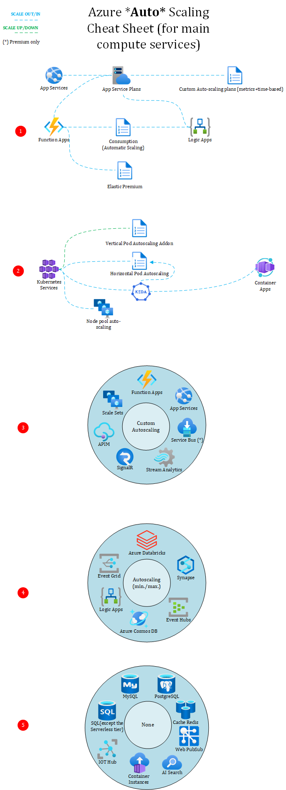

# Autoscaling with the main Azure Compute services
Before diving into the contents, let me recap some basics about scaling.

- Scaling Out/In is the ability of a system to add and remove instances, based on a given compute size, to accommodate a peak/low load. Scaling out/in is also referred to as **Horizontal Scaling**.
- Scaling Up/Down is the ability of a system to increase the amount of resources (CPU, Memory, DTU, RU, IOPS, etc.) **of a given instance**. Scaling up/down is also referred to as **Vertical Scaling**.
 
# Cheat Sheet 

> DISCLAIMER: I'll try to keep this up to date but the Cloud is a moving target so there might be gaps by the time you look at this cheat sheet! Always double-check if what is depicted in the cheat sheet still reflects the current situation. I only took into account the **most** frequently used services, not the entire Azure service catalog.

# Attention Points

## (1) Azure App Service, Functions and Logic Apps

These three services can be hosted on the same underlying compute resource, namely an *App Service Plan*. These types of plans support *Custom Autoscaling*, which is based on time-based or metric-based autoscaling, where the rules can be defined by the Cloud consumer.

Both Azure Functions and Logic Apps also support the *Consumption Tier*, which is serverless. This tier scales automatically according to the actual demand. However, a major downside of the Consumption tier is that it cannot access non-internet facing resources, since it does not integrate with Virtual Networks. That's why App Service Plans are often preferred over pure Consumption. For Azure Functions, you can use the *Elastic Premium* tier, which has all the benefits of Consumption (fast scaling, cost-friendly) without the downsides.  Whatever type of App Service Plan you opt for, you should pay attention to the **Application Density** in case you share a plan across multiple business applications. Azure App Service's default way of scaling out, is by replicating **every application** onto the underlying worker nodes. At a certain point in time, this might not help to scale out anymore as the shared compute might not be able to accommodate enough CPU/Memory for all the apps. Note that it is technically possible to perform per-app scale out, but I do not recommend it, because of the complexity it introduces.

## (2) Azure Kubernetes Service and Container Apps

Both services offer advanced scaling capabilities thanks to *KEDA* (Kubernetes Event-driven Autoscaling). With plain AKS, you can also leverage the mere *HPA* (**Horizontal** Pod Autoscaling), which is manipulated by KEDA under the hoods. The only reason why you would use HPA directly is if you are starting your AKS journey and want to have something as simple as possible. However, KEDA is a graduated CNCF product and rather easy to get started with.
*Azure Container Apps* is a layer on top of Kubernetes, hence the reason why it also supports KEDA. At last, with AKS, you can also leverage the Vertical Pod Autoscaling feature which allows you to handle pod-level vertical scaling.

## (3) Custom Autoscaling Plans
Custom Autoscaling Plans allow you to define rules, based on time (ie: every morning at 6AM add more instances and remove them as of 8PM), or based on metrics (ie: if CPU > 80% during 5min, add an extra instance).

## (4) Autoscaling with minimum and maximum boundaries

In this type of autoscaling, you can define the minimum and the maximum number of instances. The service will then use these boundaries to scale out/in the number of instances as it sees fit.

## (5) Services that do not support autoscaling

Surprisingly, quite a few services do not support autoscaling, which means that you have to undertake a *manual* scaling if needed. For these types of services, it is particulary important to focus on the non-functional requirements to choose the most appropriate pricing tier.

Similarly, many other satellite services (non-compute), such as Key Vault, Azure App Configuration, etc. do not support autoscaling and are subject to throttling.

# Real-world Observations and important notes

Autoscaling plans are most of the times defined to help handle peak workloads and optimize costs. You should pay attention to the following items when enabling autoscaling:

- Try to work with stateless services. This means that you should avoid caching information in-process and rather leverage the *Cache-aside* pattern. 
- Do not use sticky sessions also known as *ARR-Affinity*, because this could lead to service disruption is devices are being sent to an instance that was removed by the autoscaling engine.
- Try to monitor the scaling events to make sure they reflect a true need. Keep in mind that autoscaling could also be triggered by malicious attacks (DOS/DDOS). Make sure to protect your compute with throttling etc. whenever applicable.
- Some services that do not support **auto**scaling, can still be scaled by leveraging *Azure Automation*, *Logic Apps*, etc. This type of scaling works best with time-based scaling operations. 